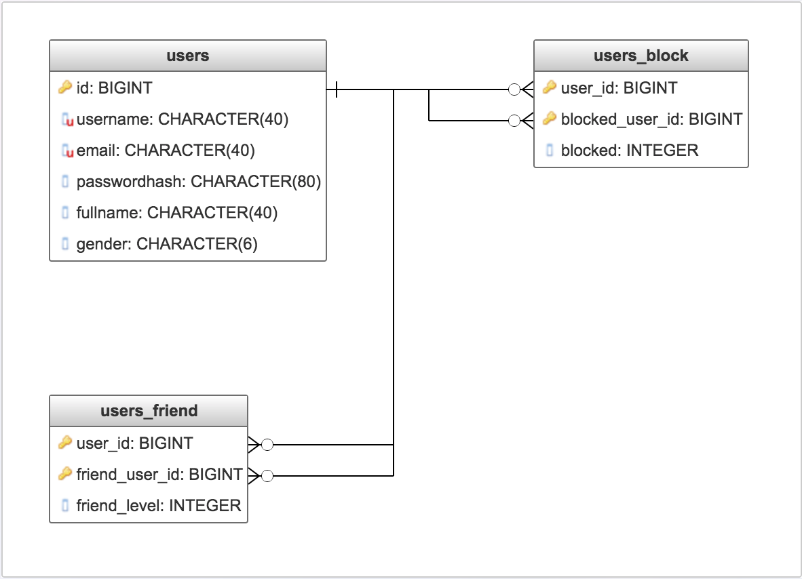

Parts Implemented by Özgün Kıvrakdal
====================================

Database Design
---------------

Users table are implemented first, and users_friend and users_blocked table reference id column on users table.
Also if any user deleted from users table, all table are automaticaly deleted from other tables.(cascade operation).

 * users table view
+--------------+-------------+-------------+------------+-------------+-------------+
| Name         | Data Type   | Null Option | Uniqueness | Primary Key | Foreign Key |
+==============+=============+=============+============+=============+=============+
| ID           | BIGSERIAL   | NOT NULL    | UNIQUE     | PRIMARY KEY |             |
+--------------+-------------+-------------+------------+-------------+-------------+
| USERNAME     | VARCHAR(40) | NOT NULL    | UNIQUE     |             |             |
+--------------+-------------+-------------+------------+-------------+-------------+
| EMAIL        | VARCHAR(40) | NOT NULL    | UNIQUE     |             |             |
+--------------+-------------+-------------+------------+-------------+-------------+
| PASSWORDHASH | VARCHAR(80) | NOT NULL    | NOT UNIQUE |             |             |
+--------------+-------------+-------------+------------+-------------+-------------+
| GENDER       | VARCHAR(6)  | NOT NULL    | NOT UNIQUE |             |             |
+--------------+-------------+-------------+------------+-------------+-------------+

*id column keeps primary key*
*username and email should be unique for every user*
*password should kept encrypted in database*
*gender column kept in database just for knowledge*

* Users_friend table view

+----------------+-----------+-------------+------------+-------------+-------------+
| Name           | Data Type | Null Option | Uniqueness | Primary Key | Foreign Key |
+================+===========+=============+============+=============+=============+
| USER_ID        | BIGINT    | NOT NULL    |            | PRIMARY KEY | FOREIGN KEY |
+----------------+-----------+-------------+------------+-------------+-------------+
| FRIEND_USER_ID | BIGINT    |             |            | PRIMARY KEY | FOREIGN KEY |
+----------------+-----------+-------------+------------+-------------+-------------+
| FRIEND_LEVEL   | SMALLINT  | NOT NULL    |            |             |             |
+----------------+-----------+-------------+------------+-------------+-------------+

*friend_level column can be 1 or 2 according to friendship status*
*if two users are friend each other, one row is enough to keep this information*

* Users_blocked table view

+-----------------+-----------+-------------+------------+-------------+-------------+
| Name            | Data Type | Null Option | Uniqueness | Primary Key | Foreign Key |
+=================+===========+=============+============+=============+=============+
| USER_ID         | BIGINT    | NOT NULL    |            | PRIMARY KEY | FOREIGN KEY |
+-----------------+-----------+-------------+------------+-------------+-------------+
| BLOCKED_USER_ID | BIGINT    | NOT NULL    |            | PRIMARY KEY | FOREIGN KEY |
+-----------------+-----------+-------------+------------+-------------+-------------+
| BLOCKED_LEVEL   | SMALLINT  | NOT NULL    |            |             |             |
+-----------------+-----------+-------------+------------+-------------+-------------+

*blocked_level column can be 1 or 2 according to blocked status*
*if one user blocks another user, one row is enough to keep this information*

   E-R diagram shows relationship between tables