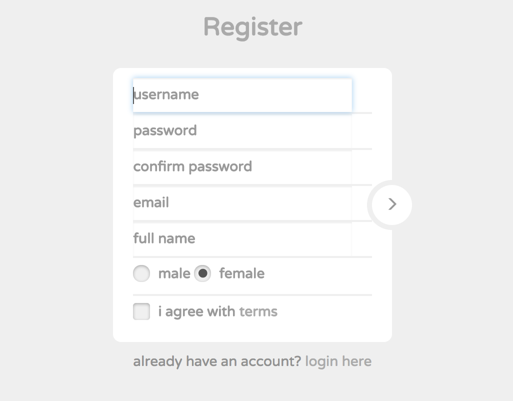
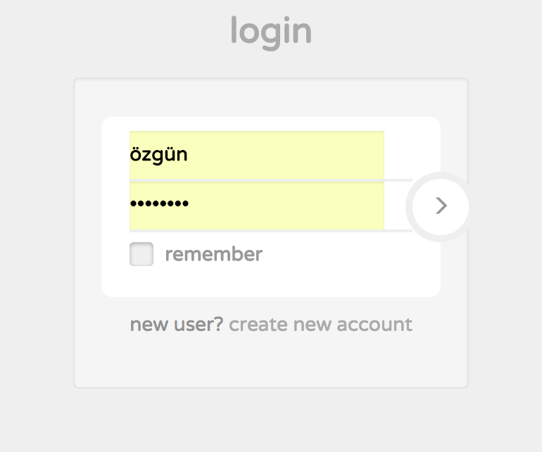
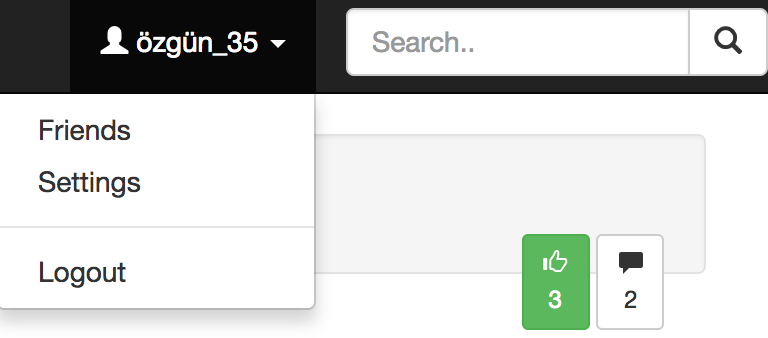
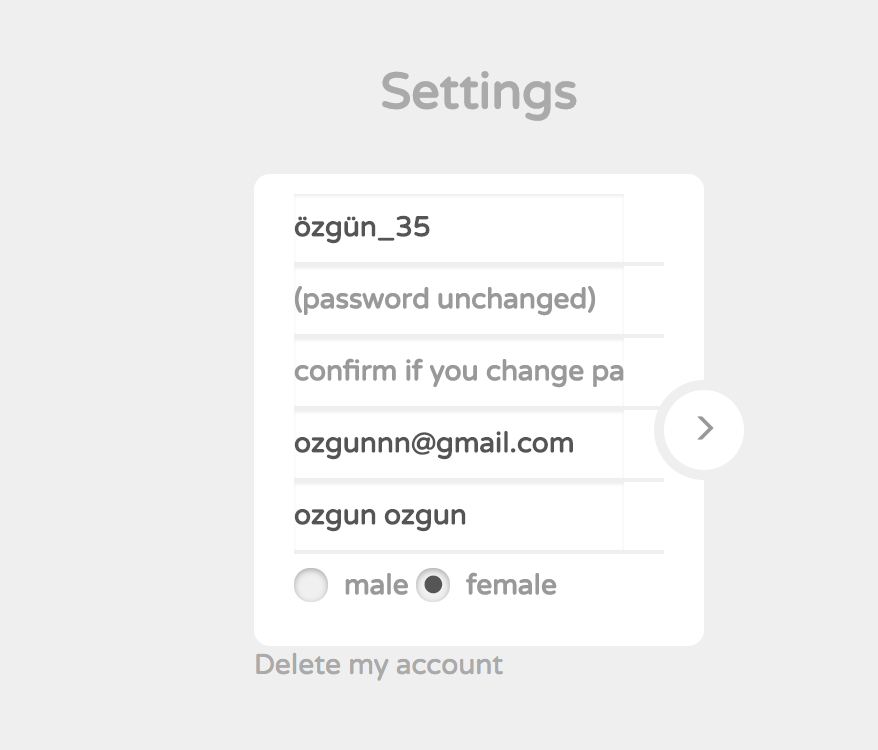
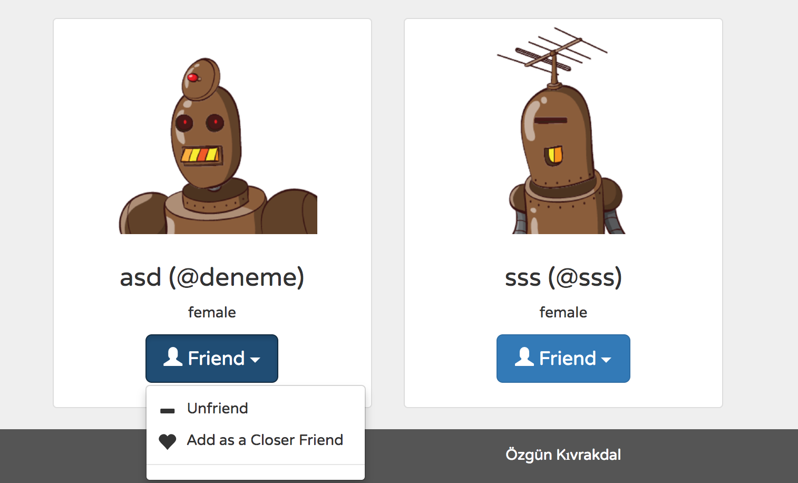
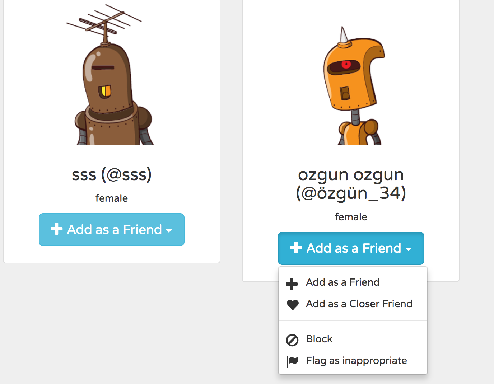
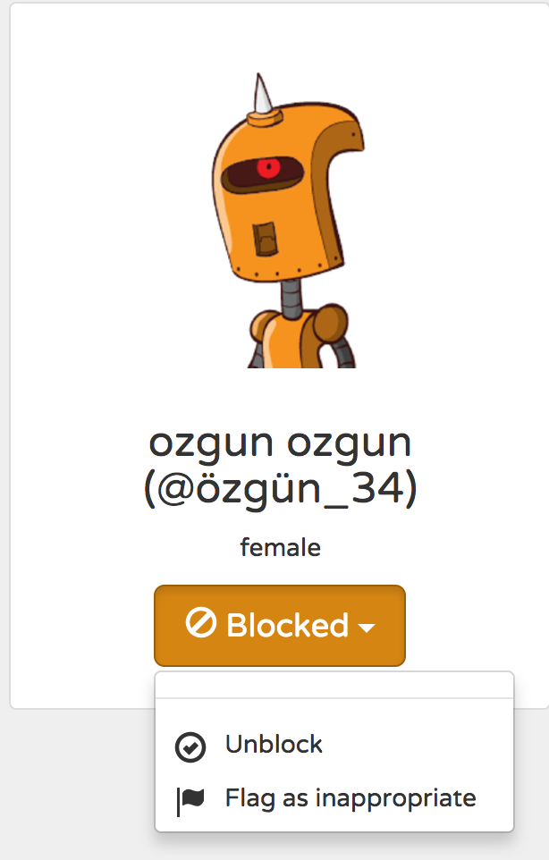

Parts Implemented by Özgün Kıvrakdal
====================================
**This part is written to explain user implementation on PostIT**

* Firstly, users should be register, to participate PostIT.

   All fields are required

* After successfully register, user can log in the site

   If user marked 'save my password' on your browser, site can remember your login information

* When logged in, users can see him/her username on the top right of the navigation bar, and they can see search bar to find other users

   If user clicks search area, they can see all users which registered on the site

* If user wants to edit him/her registiration information, it can use setting tab on the account name. Users can also see own friends on the friends tab. When user want to logout it can click logout tab.

   setting, friends and logout area for user

* Users edit their information on settings page.

* Users friends look like the following. User can edit friendship status by clicking friend tab

   When user wants make unfriend and close friend that user it can manage as shown.

* In add as a friend button, user can find add friend,add as a close friend, blocked and flag as an inappropriate flag.

* If user wans to withdrow block status from any user they can edit this and also user can edit blocked status as an inappropriate.

